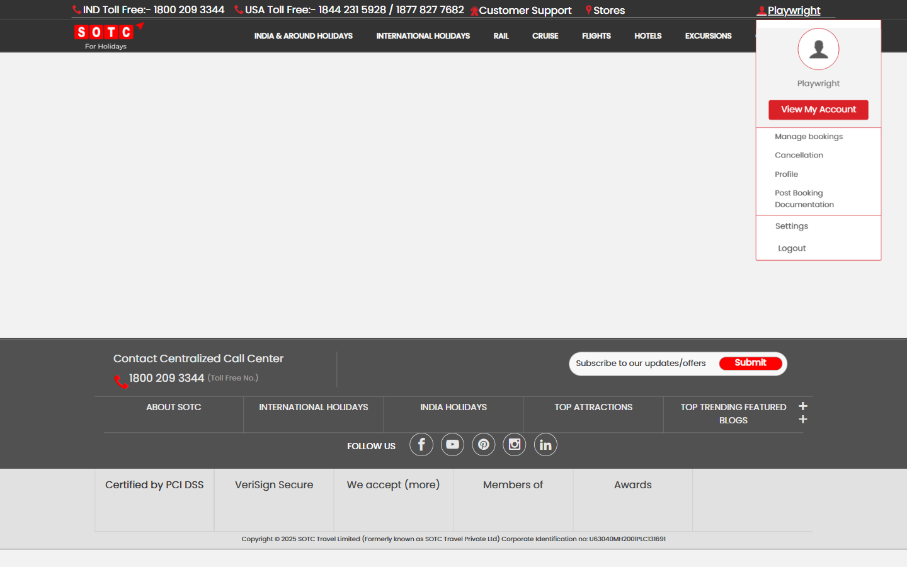
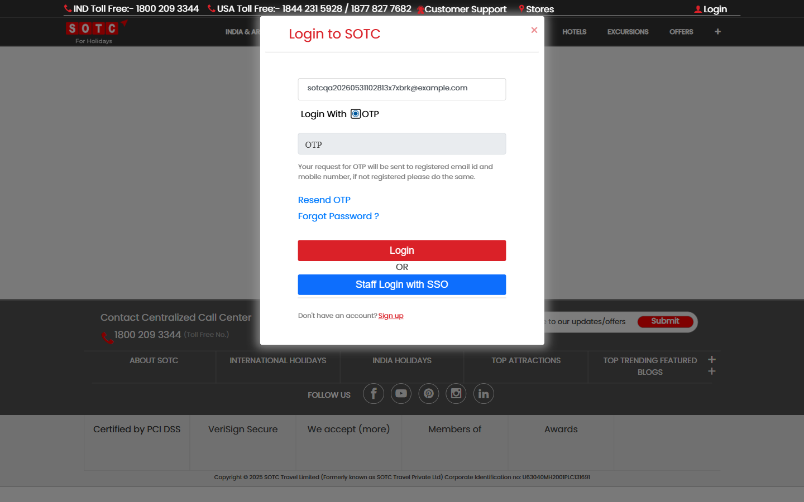
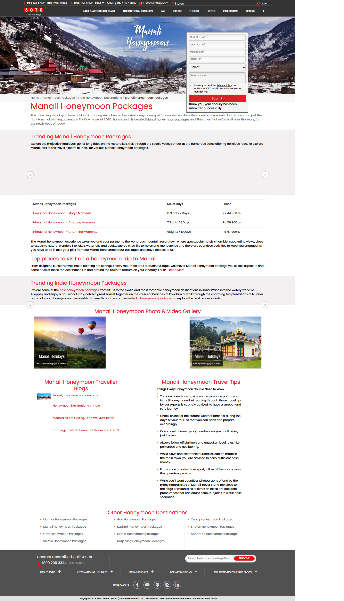

# SOTC Playwright Automation Portfolio

Portfolio-ready Playwright + TypeScript automation for public SOTC account and enquiry-form experiences.

This project covers the core customer account flow and a live honeymoon campaign enquiry form with a Page Object Model, environment-driven test data, failure diagnostics, Playwright HTML reporting, and Allure reporting.

## What This Project Tests

- New customer sign-up on the SOTC account page
- Existing customer login journey for the live public flow
- Campaign enquiry form coverage on the Manali honeymoon page
- Stable post-action verification with screenshots and traces

## Live Behavior Note

The original goal included password login after sign-up. During live verification on **May 31, 2026**, the public SOTC customer flow exposed **OTP-first login for email-based customer accounts** and hid the password path in the UI for that journey.

Because of that live product behavior, the suite currently validates:

- `sotc-signup.spec.ts`: a new user can register successfully
- `sotc-login.spec.ts`: an existing user can successfully start the live OTP login journey

The page object still keeps password-path handling in place so the suite can be extended easily if SOTC re-enables it for customer accounts.

## Honeymoon Form Note

During live verification on **June 1, 2026**, the Manali honeymoon page at `https://www.sotc.in/india-honeymoon/manali-honeymoon-packages` exposed a small enquiry form with stable field IDs for first name, last name, mobile, email, product, description, privacy consent, and submit.

The live campaign script currently still references a missing legacy `#full_name` field and only raises an alert for privacy consent instead of blocking submit. The form suite documents those behaviors honestly and uses a small compatibility shim plus a mocked CRM endpoint for the valid-path test so the front-end contract can be verified without creating real lead noise.

## Tech Stack

- Playwright
- TypeScript
- Page Object Model
- Allure Report
- Playwright HTML Report

## Highlights

- Clean Page Object Model in [`pages/SotcAccountPage.ts`](./pages/SotcAccountPage.ts)
- Dynamic email and mobile generation to avoid duplicate data collisions
- Environment-variable based test configuration
- `test.step` usage for readable execution
- Automatic screenshots
- Trace and video retention on failure
- Allure result generation and report rendering

## Project Structure

```text
pages/
  SotcAccountPage.ts
  SotcHoneymoonEnquiryPage.ts
tests/
  sotc-signup.spec.ts
  sotc-login.spec.ts
  sotc-honeymoon-form.spec.ts
utils/
  sotcAccountTestData.ts
  sotcHoneymoonFormData.ts
playwright.config.ts
package.json
```

## Screenshots

### Sign-up success



### OTP login journey



### Honeymoon enquiry form



## Setup

Install dependencies:

```powershell
npm install
```

Create environment variables from the sample file:

```powershell
Copy-Item .env.example .env
```

Minimum required variable:

```powershell
$env:SOTC_TEST_PASSWORD='Test123!'
```

Optional variables:

- `SOTC_BASE_URL`
- `SOTC_ACCOUNT_URL`
- `SOTC_HONEYMOON_FORM_URL`
- `SOTC_TEST_FIRST_NAME`
- `SOTC_TEST_LAST_NAME`
- `SOTC_TEST_EMAIL`
- `SOTC_TEST_PASSWORD`
- `SOTC_TEST_MOBILE`

## Run Tests

Run the split suite:

```powershell
$env:SOTC_TEST_PASSWORD='Test123!'
$env:SOTC_TEST_FIRST_NAME='Playwright'
$env:SOTC_TEST_LAST_NAME='Tester'
npm run test:sotc
```

Run in headed mode:

```powershell
$env:SOTC_TEST_PASSWORD='Test123!'
$env:SOTC_TEST_FIRST_NAME='Playwright'
$env:SOTC_TEST_LAST_NAME='Tester'
npm run test:headed
```

Run individual specs:

```powershell
npm run test:sotc-signup
npm run test:sotc-login
npm run test:sotc-honeymoon-form
```

## Reports

Generate Allure report:

```powershell
npm run allure:generate
```

Open Allure report:

```powershell
npm run allure:open
```

Serve Allure report:

```powershell
npm run allure:serve
```

Generated artifacts:

- Playwright HTML report: `playwright-report/index.html`
- Allure report: `allure-report/index.html`

## Why This Is Portfolio-Ready

- Uses production-style Playwright structure instead of a single flat spec
- Handles real-world live-site quirks such as dynamic UI states and OTP-only login behavior
- Documents product behavior honestly rather than faking a green test
- Produces shareable evidence through screenshots and reports

## Author

Created by **Sangram7057** as a real-world browser automation portfolio project.
